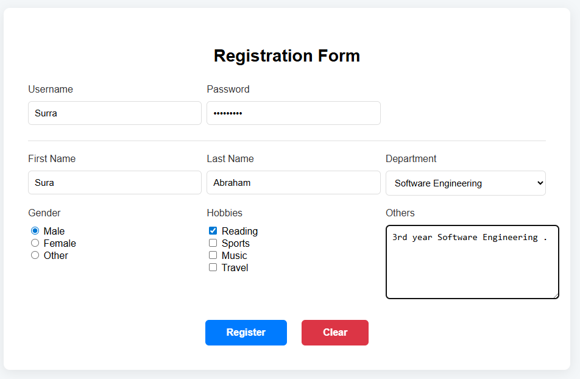
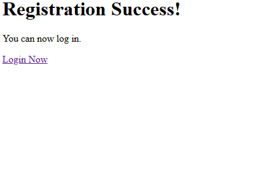
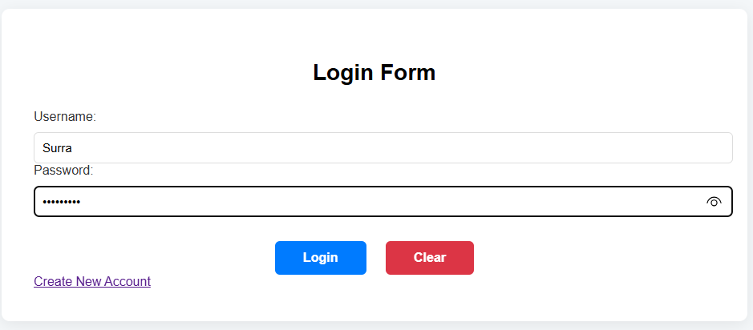
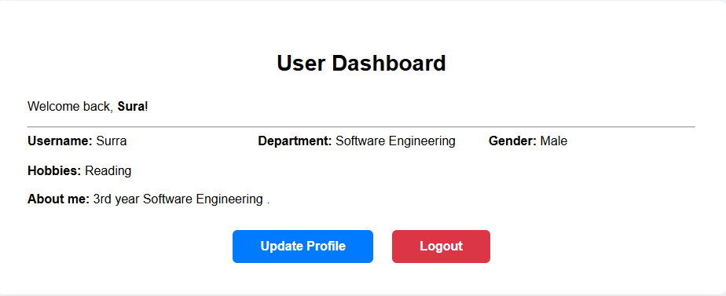

# 🛡️ Secure Login & Registration System

A full-stack web application featuring a secure user authentication system with a custom MySQL database integration.

## 🚀 Features
- **Secure Registration:** Includes real-time password strength validation (Uppercase, Lowercase, Numbers, and Symbols).
- **Safe Authentication:** Uses PHP `password_hash` and `password_verify` for industry-standard security.
- **User Dashboard:** A private member area that uses PHP Sessions to keep users logged in.
- **Profile Management:** Users can update their department and "About Me" information.
- **Responsive Design:** Clean, modern UI with 3-column grid layouts and professional shadows.

## 🛠️ Tech Stack
- **Frontend:** HTML5, CSS3, JavaScript (ES6)
- **Backend:** PHP 8.x
- **Database:** MySQL (MariaDB)
- **Server:** XAMPP / Apache

## 📸 Screenshots
### Registration Page

### Registration Success

### Login Page

### Dashboard

## ⚙️ Installation & Setup
1. **Clone the project** into your XAMPP `htdocs` folder.
2. **Start XAMPP:** Turn on Apache and MySQL.
3. **Database Setup:**
   - Go to `http://localhost/phpmyadmin`
   - Create a database named `user_system`.
   - Import the `database.sql` file or run the SQL commands provided in the project files.
4. **Configuration:**
   - Open `db_config.php` and ensure the port is set to `3307` (or your specific MySQL port).
5. **Run:** Access the project at `http://localhost/LOGIN_SYSTEM/login.html`.

## 🔒 Security Features Implemented
- **SQL Injection Prevention:** Uses Prepared Statements (`$stmt`).
- **XSS Protection:** Uses `htmlspecialchars()` for rendering user data.
- **Password Security:** Minimum 8 characters with complex requirements.